# TaskNote - Aplikasi Catatan dan Checklist

Aplikasi manajemen catatan dan checklist berbasis Flutter yang dikembangkan sebagai Ujian Tengah Semester (UTS) mata kuliah Pemrograman Mobile.

---

## Informasi Kelompok

| Nama                    | NIM       |
| ----------------------- | --------- |
| Zaki Muhamad            | 2306094   |
| Wildan Syaeful Millah   | 2306118   |

**Mata Kuliah:** Pemrograman Mobile  
**Jenis Ujian:** Ujian Tengah Semester (UTS)

---

## Deskripsi Aplikasi

TaskNote adalah aplikasi mobile yang memungkinkan pengguna untuk membuat, mengelola, dan melacak catatan serta checklist secara efisien. Aplikasi ini dibangun menggunakan framework Flutter dengan pendekatan Material Design modern, sehingga dapat berjalan pada platform Android, iOS, Web, Windows, Linux, dan macOS.

---

## Screenshots

### Splash Screen

| Splash Screen |
| :---: |
| 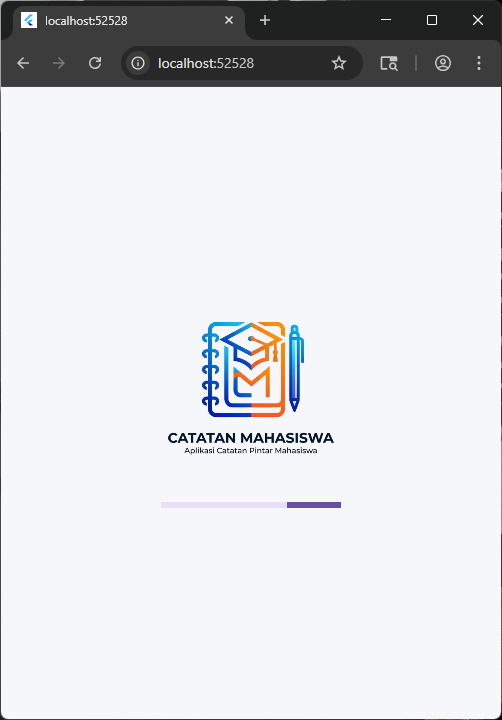 |

### Halaman Login

| Login | Password Terlihat | Validasi Username Kosong |
| :---: | :---: | :---: |
| 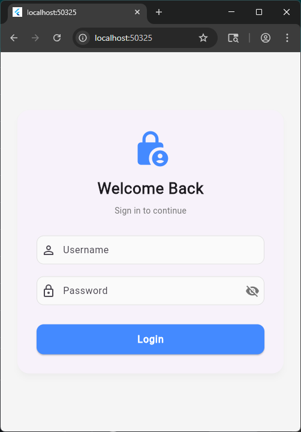 | 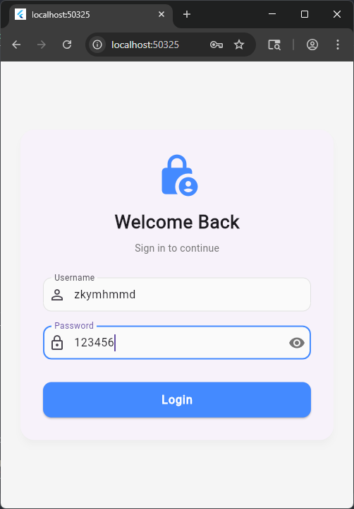 | 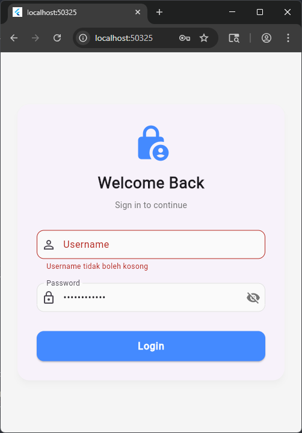 |

| Validasi Password Kosong | Username/Password Salah |
| :---: | :---: |
| 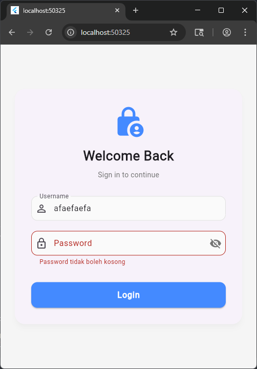 | 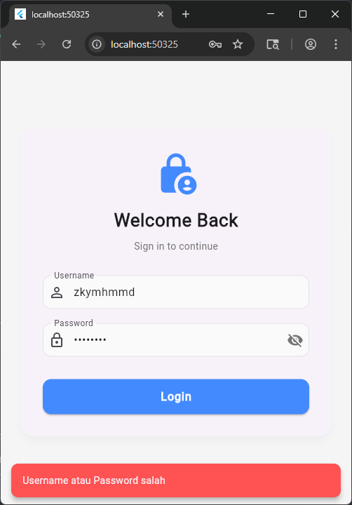 |

### Halaman Dashboard

| Dashboard (Kosong) | Dashboard (Ada Catatan) |
| :---: | :---: |
| 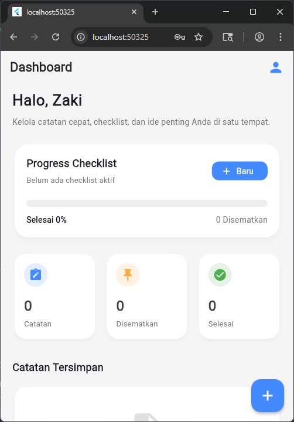 | 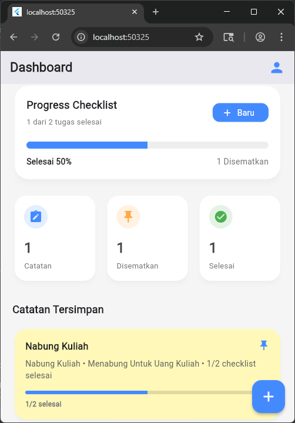 |

### Halaman Catatan

| Halaman Catatan | Form Catatan Baru | Catatan Card |
| :---: | :---: | :---: |
| 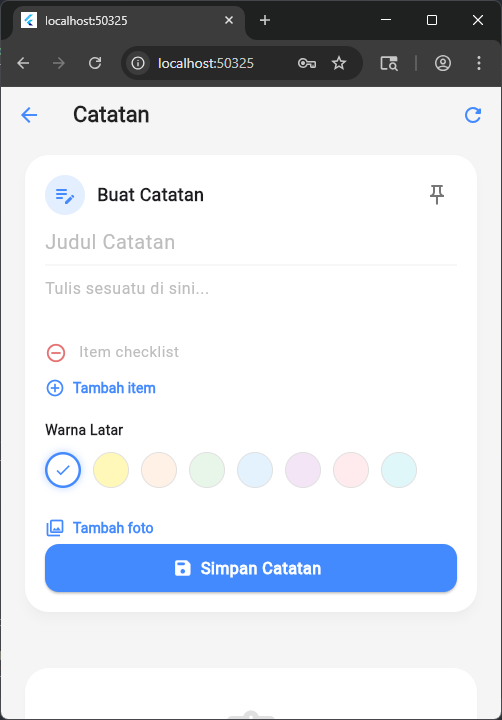 | 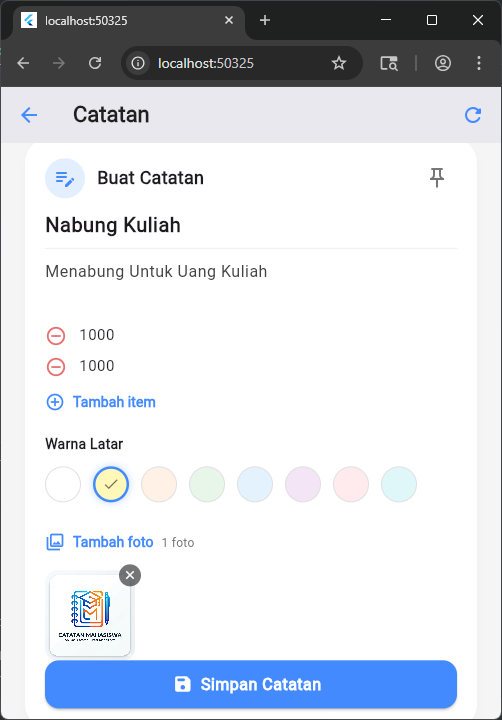 | 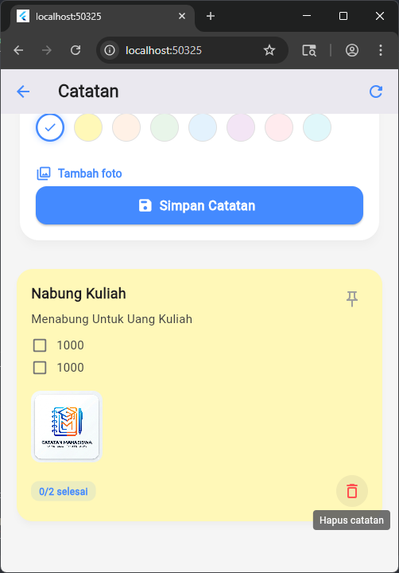 |

| Checklist Dicentang | Catatan Disematkan |
| :---: | :---: |
| 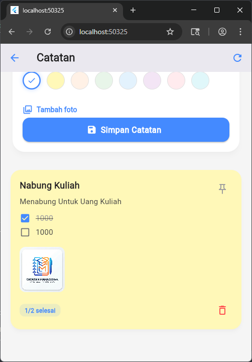 | 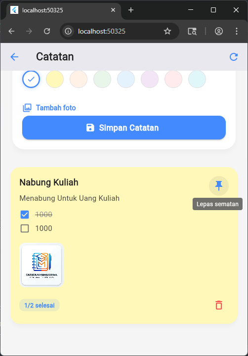 |

### Halaman Profil

| Profil | Edit Profil |
| :---: | :---: |
| 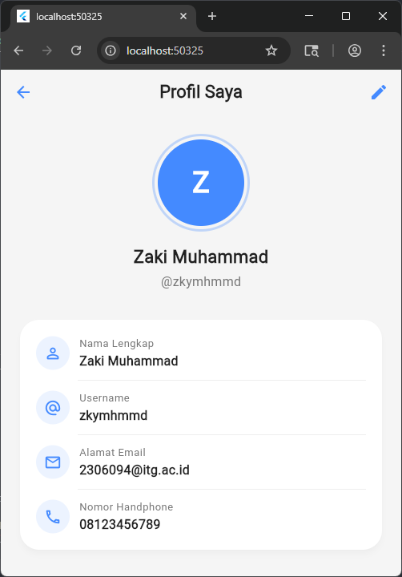 | 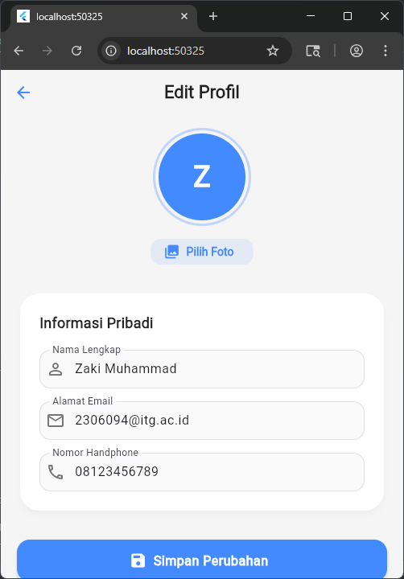 |

### Logout

| Tombol Logout | Konfirmasi Logout |
| :---: | :---: |
| 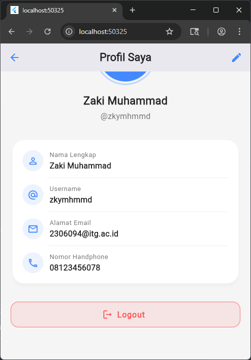 | 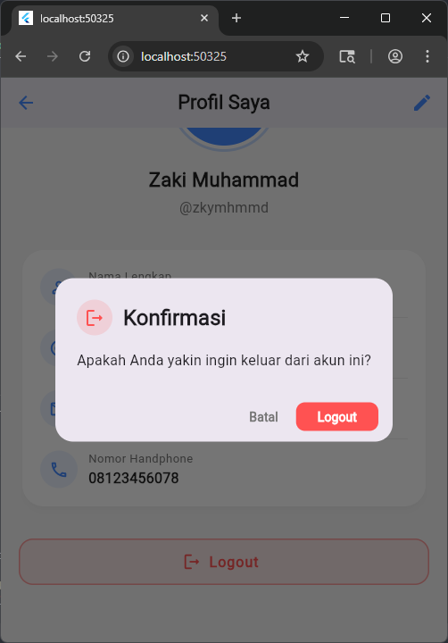 |

---

## Fitur Utama

### 1. Autentikasi Pengguna
- Halaman login dengan validasi form (username dan password).
- Sistem autentikasi berbasis data lokal (hardcoded user credentials).
- Toggle visibilitas password.

### 2. Dashboard
- Tampilan ringkasan statistik catatan: jumlah total catatan, catatan yang disematkan, dan checklist yang telah selesai.
- Progress bar keseluruhan untuk melacak penyelesaian checklist.
- Daftar catatan tersimpan dengan preview konten.
- Riwayat checklist dengan kemampuan toggle item secara langsung.
- Greeting personal berdasarkan nama pengguna yang sedang login.

### 3. Manajemen Catatan (Task/Note)
- Membuat catatan baru dengan judul, konten teks, dan checklist item.
- Menambah dan menghapus item checklist secara dinamis.
- Toggle status checklist item (selesai/belum selesai).
- Menyematkan (pin) catatan penting agar tampil di posisi teratas.
- Memilih warna latar belakang catatan dari 8 pilihan warna.
- Melampirkan gambar dari galeri perangkat ke dalam catatan.
- Preview gambar secara fullscreen dengan fitur zoom (InteractiveViewer).
- Menghapus catatan.
- Pengurutan otomatis berdasarkan status pin dan waktu pembaruan terakhir.

### 4. Profil Pengguna
- Menampilkan informasi lengkap pengguna: nama, username, email, dan nomor handphone.
- Avatar dengan inisial nama atau foto profil.
- Navigasi ke halaman edit profil.

### 5. Edit Profil
- Mengubah nama lengkap, alamat email, dan nomor handphone.
- Mengunggah dan menghapus foto profil dari galeri perangkat.
- Validasi form pada setiap field input.

### 6. Splash Screen
- Halaman pembuka dengan logo aplikasi dan indikator loading.
- Navigasi otomatis ke halaman login setelah 3 detik.

### 7. Logout
- Dialog konfirmasi sebelum logout.
- Navigasi kembali ke halaman login dengan membersihkan seluruh history navigasi.

---

## Teknologi yang Digunakan

| Komponen          | Teknologi                     |
| ----------------- | ----------------------------- |
| Framework         | Flutter                       |
| Bahasa            | Dart                          |
| SDK               | Dart SDK ^3.11.0              |
| State Management  | setState (StatefulWidget)     |
| Image Picker      | image_picker ^1.1.2           |
| Design System     | Material Design 3             |
| Linting           | flutter_lints ^6.0.0          |

---

## Struktur Proyek

```
lib/
 ├── main.dart                      # Entry point aplikasi
 ├── model/
 │    ├── task_model.dart            # Model data Task dan ChecklistItem
 │    └── user_model.dart            # Model data User
 ├── page/
 │    ├── splash_page.dart           # Halaman splash screen
 │    ├── login_page.dart            # Halaman login
 │    ├── home_page.dart             # Halaman dashboard utama
 │    ├── task_page.dart             # Halaman manajemen catatan
 │    ├── profile_page.dart          # Halaman profil pengguna
 │    └── edit_profile_page.dart     # Halaman edit profil
 └── util/
      ├── image_helper.dart          # Conditional import untuk image rendering
      ├── image_helper_io.dart       # Image rendering untuk platform native (IO)
      └── image_helper_stub.dart     # Image rendering untuk platform web
```

---

## Alur Navigasi Aplikasi

```
Splash Screen
    |
    v
Login Page
    |
    v
Home Page (Dashboard)
    |
    ├── Task Page (Manajemen Catatan)
    |
    └── Profile Page
            |
            ├── Edit Profile Page
            |
            └── Logout --> Login Page
```

---

## Arsitektur dan Pola Desain

- **Pola MVC sederhana:** Pemisahan antara model data (`model/`), halaman tampilan (`page/`), dan utilitas (`util/`).
- **Conditional Import:** Menggunakan conditional import pada `image_helper.dart` untuk mendukung rendering gambar yang adaptif antara platform native (menggunakan `dart:io`) dan platform web (menggunakan `Image.network`).
- **In-Memory Data:** Seluruh data catatan dan pengguna disimpan di memori (runtime) tanpa database atau penyimpanan persisten.

---

## Akun Demo

Aplikasi ini menyediakan dua akun demo yang telah terdaftar:

| Username       | Password  |
| -------------- | --------- |
| zkymhmmd       | 123456    |
| wldnsyflmllh   | 654321    |

---

## Prasyarat

- Flutter SDK ^3.11.0
- Dart SDK ^3.11.0
- Android Studio / VS Code (dengan ekstensi Flutter dan Dart)
- Emulator Android / iOS Simulator / perangkat fisik

---

## Cara Menjalankan

1. Clone repositori ini.

```bash
git clone <repository-url>
cd uts
```

2. Install dependensi.

```bash
flutter pub get
```

3. Jalankan aplikasi.

```bash
flutter run
```

Untuk menjalankan pada platform tertentu:

```bash
flutter run -d chrome      # Web
flutter run -d windows      # Windows
flutter run -d android      # Android
flutter run -d ios           # iOS
```

---

## Dependensi

| Package         | Versi    | Keterangan                                |
| --------------- | -------- | ----------------------------------------- |
| flutter         | SDK      | Framework utama                           |
| image_picker    | ^1.1.2   | Pengambilan gambar dari galeri/kamera      |
| flutter_lints   | ^6.0.0   | Aturan lint untuk kualitas kode (dev)     |

---

## Catatan Teknis

- Aplikasi ini menggunakan penyimpanan in-memory, sehingga seluruh data akan hilang ketika aplikasi ditutup atau di-restart.
- Foto profil disimpan dalam format byte array (`List<int>`) di dalam objek `User`.
- Gambar pada catatan direferensikan melalui path file lokal dan dirender secara adaptif sesuai platform yang digunakan.
- Navigasi antar halaman menggunakan `Navigator.push`, `Navigator.pushReplacement`, dan `Navigator.pushAndRemoveUntil` sesuai kebutuhan flow aplikasi.
